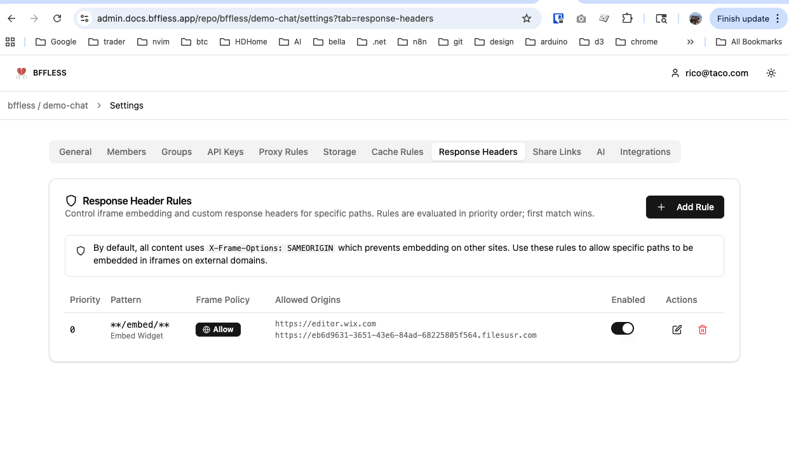

# Chat Demo

A chat demo with multiple deployment modes: full-page chat, popup widget, and an embeddable iframe widget for any website (including Wix).

## Features

- Real-time streaming responses
- Auto-scroll to latest messages
- Status indicators (streaming, sending, error, ready)
- Suggestion buttons for quick start
- Stop button to abort streaming
- Keyboard shortcuts (Enter to send, Shift+Enter for new line)
- Conversation persistence via localStorage
- Markdown rendering with syntax highlighting
- Rate limit handling with countdown

## Entry Points

| Path | Description |
|------|-------------|
| `/` | Full-page chat UI |
| `/popup/` | Popup widget demo (floating button + slide-up panel) |
| `/embed/` | Iframe-ready chat panel (no chrome, used by embed.js) |
| `/embed.js` | Lightweight vanilla JS script for embedding on any site |

## Development

```bash
pnpm install
pnpm dev          # Start dev server (port 3002)
pnpm build        # Build all entry points + embed.js
pnpm preview      # Preview production build
```

## Embedding the Chat Widget

The chat widget can be embedded on any website using an iframe approach. A lightweight script (`embed.js`, ~4KB) handles the floating button and iframe container, while the actual chat UI runs inside an iframe hosted on BFFless.

### Option 1: embed.js (any website)

Add this to any HTML page:

```html
<script>
  window.BfflessChat = { url: 'https://chat.docs.bffless.app' };
</script>
<script src="https://chat.docs.bffless.app/embed.js" defer></script>
```

Configuration options on `window.BfflessChat`:

| Option | Type | Default | Description |
|--------|------|---------|-------------|
| `url` | string | **required** | Base URL of the BFFless chat deployment |
| `primaryColor` | string | `#3b82f6` | Button background color |
| `position` | string | `bottom-right` | `bottom-right` or `bottom-left` |
| `title` | string | `Chat` | iframe title attribute |

### Option 2: Wix (Velo + HtmlComponents)

Wix sandboxes custom HTML in iframes, so embed.js won't work directly. Instead, use two HtmlComponents controlled by Velo.

#### Setup

1. **Enable Dev Mode** in the Wix editor (top menu bar)

2. **Add HtmlComponent #html1** (the chat button):
   - Size: **80x80px**, positioned at bottom-right
   - Paste this code:

```html
<html>
<head>
<style>
  * { margin: 0; padding: 0; }
  body { background: transparent; }
  button {
    width: 56px;
    height: 56px;
    border-radius: 50%;
    border: none;
    background: #3b82f6;
    cursor: pointer;
    box-shadow: 0 4px 12px rgba(0,0,0,0.15);
    display: flex;
    align-items: center;
    justify-content: center;
    transition: transform 0.2s;
    position: fixed;
    bottom: 10px;
    right: 10px;
  }
  button:hover { transform: scale(1.05); }
  button svg { width: 24px; height: 24px; }
  .icon-close { display: none; }
  button.open .icon-chat { display: none; }
  button.open .icon-close { display: block; }
</style>
</head>
<body>
  <button id="btn" aria-label="Open chat">
    <svg class="icon-chat" viewBox="0 0 24 24" fill="white">
      <path d="M21 15a2 2 0 0 1-2 2H7l-4 4V5a2 2 0 0 1 2-2h14a2 2 0 0 1 2 2z"/>
    </svg>
    <svg class="icon-close" viewBox="0 0 24 24" fill="none" stroke="white" stroke-width="2">
      <line x1="18" y1="6" x2="6" y2="18"/>
      <line x1="6" y1="6" x2="18" y2="18"/>
    </svg>
  </button>
  <script>
    document.getElementById('btn').addEventListener('click', function() {
      window.parent.postMessage('toggle-chat', '*');
    });
    window.addEventListener('message', function(e) {
      var btn = document.getElementById('btn');
      if (e.data === 'chat-opened') {
        btn.classList.add('open');
      } else if (e.data === 'chat-closed') {
        btn.classList.remove('open');
      }
    });
  </script>
</body>
</html>
```

3. **Add HtmlComponent #html2** (the chat panel):
   - Size: **400x600px**, positioned at bottom-right (above the button)
   - Paste this code:

```html
<html>
<head>
<style>
  * { margin: 0; padding: 0; }
  body { background: transparent; display: none; }
  iframe { width: 100%; height: 100%; border: none; border-radius: 16px; }
</style>
</head>
<body>
  <iframe src="https://chat.docs.bffless.app/embed/" title="Chat"></iframe>
  <script>
    window.addEventListener('message', function(e) {
      if (e.data === 'show-chat') {
        document.body.style.display = 'block';
      } else if (e.data === 'hide-chat') {
        document.body.style.display = 'none';
      }
      if (e.data && e.data.type === 'bffless-chat:close') {
        window.parent.postMessage('close-chat', '*');
      }
    });
  </script>
</body>
</html>
```

4. **Add Velo code** in `masterPage.js` (so it runs on every page):

```javascript
$w.onReady(function () {
  var chatOpen = false;

  $w('#html1').onMessage(function (event) {
    if (event.data === 'toggle-chat') {
      chatOpen = !chatOpen;
      if (chatOpen) {
        $w('#html2').postMessage('show-chat');
      } else {
        $w('#html2').postMessage('hide-chat');
      }
      $w('#html1').postMessage(chatOpen ? 'chat-opened' : 'chat-closed');
    }
  });

  $w('#html2').onMessage(function (event) {
    if (event.data === 'close-chat') {
      chatOpen = false;
      $w('#html2').postMessage('hide-chat');
      $w('#html1').postMessage('chat-closed');
    }
  });
});
```

### Configuring Response Headers (Required)

The `/embed/` path needs a response header rule to allow cross-origin iframe embedding. Without this, the browser blocks the iframe due to the default `X-Frame-Options: SAMEORIGIN` policy.

1. Go to your project's **Settings > Response Headers** tab in the BFFless admin panel
2. Click **+ Add Rule** and configure:
   - **Name:** Embed Widget
   - **Path Pattern:** `**/embed/**`
   - **Frame Policy:** Allow from specific origins
   - **Allowed Origins:** Add the domain(s) that will embed the widget (e.g., `https://editor.wix.com`, `https://www.hannahnicol.com`)
3. Save the rule



This sets `Content-Security-Policy: frame-ancestors 'self' <your-origins>` on the `/embed/` path, allowing those domains to iframe the chat widget.

## Architecture

```
Host Site (Wix, WordPress, any site)
+---------------------------------------------+
|  embed.js (vanilla JS, ~4KB, shadow DOM)    |
|  - Floating chat button                     |
|  - iframe container (lazy loaded)           |
|  - postMessage communication                |
+-----------+---------------------------------+
            | postMessage
            v
+---------------------------------------------+
|  iframe src=".../embed/"                    |
|  React app reusing ChatPanel components     |
|  - Full chat UI filling iframe              |
|  - API calls to same-origin /api/chat       |
|  - Posts close/unread events to parent      |
+---------------------------------------------+
```

### PostMessage Protocol

All messages prefixed with `bffless-chat:` to avoid collisions.

| Direction | Type | Payload | Purpose |
|-----------|------|---------|---------|
| Parent -> iframe | `bffless-chat:init` | `{ primaryColor?, title? }` | Config on ready |
| Parent -> iframe | `bffless-chat:reset` | `{}` | Clear conversation |
| iframe -> Parent | `bffless-chat:ready` | `{}` | iframe loaded |
| iframe -> Parent | `bffless-chat:close` | `{}` | User clicked close |
| iframe -> Parent | `bffless-chat:unread` | `{ count: number }` | New messages badge |

## API Endpoint

The chat expects a backend endpoint at `/api/chat` that handles streaming chat responses. In development, requests are proxied to `https://chat.docs.bffless.app` via Vite's proxy configuration.

## Tech Stack

- React 18
- TypeScript
- Vite
- Tailwind CSS 4
- `@ai-sdk/react` for chat functionality
- `react-markdown` + `remark-gfm` for message rendering
